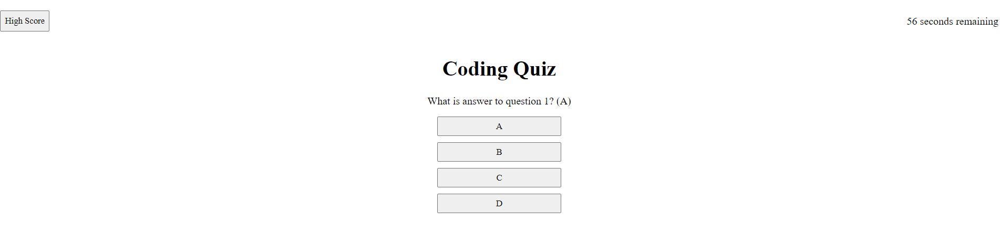

# Code Quiz

## Discription
This is a little multiple choice quiz with a 60 second time limit. Final scores are based off the amount of time left when the quiz is completed. When the user gets a question right the next question is displayed, but if they get the question wrong they will lose 15 seconds off their time. The quiz ends when either all questions have been answered or the time reaches 0. High scores are stored locally and the quiz restarts when the user inputs their initials.

## Features
- Quiz questions automatically cycle to the next upon selecting an answer.
- Time is reduced when wrong answer is selected.
- Final score is stored locally

*Preview of my work*

Technology Used         | Resource URL           | 
| ------------- |:-------------:| 
| HTML       | [https://developer.mozilla.org/en-US/docs/Web/HTML](https://developer.mozilla.org/en-US/docs/Web/HTML) | 
| CSS        | [https://developer.mozilla.org/en-US/docs/Web/CSS](https://developer.mozilla.org/en-US/docs/Web/CSS)      |   
| Git        | [https://git-scm.com/](https://git-scm.com/)     |    
| JavaScript | [https://developer.mozilla.org/en-US/docs/Web/JavaScript](https://developer.mozilla.org/en-US/docs/Web/JavaScript) |
 [Visit the Deployed Site]( https://andrewchall92.github.io/code-quiz/)

 ## License
 This project is licensed under the [MIT License](LICENSE).